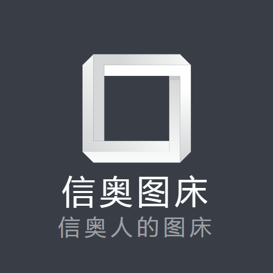

 
cola-pig1121.github.io【信奥图床】

 

请大声喊出我们的口号： 没有bug的代码不是好代码 能KO一个bug的只有更多的bug!!!

 

## [What's it like to be a sweet couple](./What's it like to be a sweet couple.mp4)

 

  <video controls>
    <source src="./What's it like to be a sweet couple.mp4" type="video/mp4"> 
  </video>

 

## [How to cheer up Furina](./How to cheer up Furina.mp4)

 

  <video controls>
    <source src="./How to cheer up Furina.mp4" type="video/mp4"> 
  </video>

 

## [Yunli & Yanqing](./Yunli and Yanqing.mp4)

 

  <video controls>
    <source src="./Yunli and Yanqing.mp4" type="video/mp4"> 
  </video>

 

 

<footer>
    
Made by <a href="bugs8.v6.army">Cola Pig</a> & 落叶听枫TC

</footer>

<head>
    <link rel="icon" type="image/x-icon" href="favicon.ico" />
</head>
